## Завдання 1: Chain of Responsibility — Ланцюжок відповідальностей

## Опис

Система підтримки складається з кількох рівнів, кожен з яких відповідає за певний тип запиту:
1. **Загальні питання** — відповідає на базові запити користувачів.
2. **Оплата** — спрямовує запити, що стосуються оплат.
3. **Технічна підтримка** — надає допомогу з технічними проблемами.
4. **Керівник служби підтримки** — дає можливість з'єднатися з керівником.
5. **Вихід з системи** — завершує роботу системи.

### Ключові класи:

1. **SupportHandler** (абстрактний клас) — основа для всіх обробників, що обробляють запити.
2. **BasicSupport**, **BillingSupport**, **TechnicalSupport**, **SupervisorSupport** — конкретні обробники для кожного рівня підтримки.
3. **ExitSupport** — обробник для виходу з системи.
4. **DefaultSupport** — обробник для випадків, коли жоден рівень не підходить.

### Доступні опції:
**1. Запит вирішується на першому рівні:**
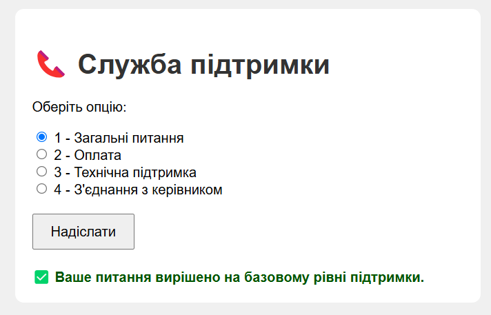

**2. Запит доходить до другого рівня:**
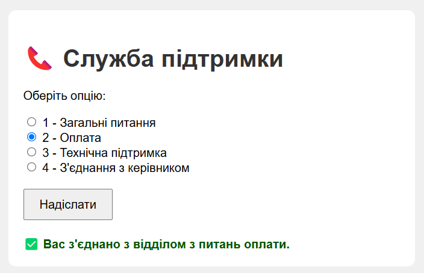

**3. Запит доходить до третього рівня:**
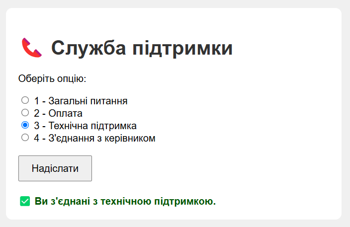

**4. Запит вирішується на четвертому рівні:**
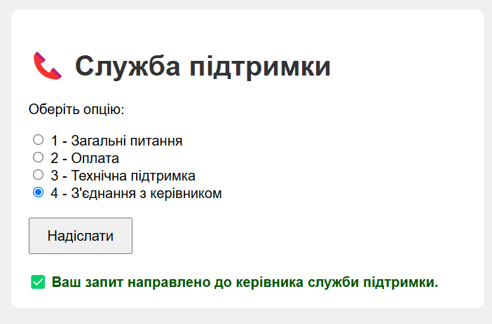

**5. Жоден рівень не підходить — меню повторюється:**
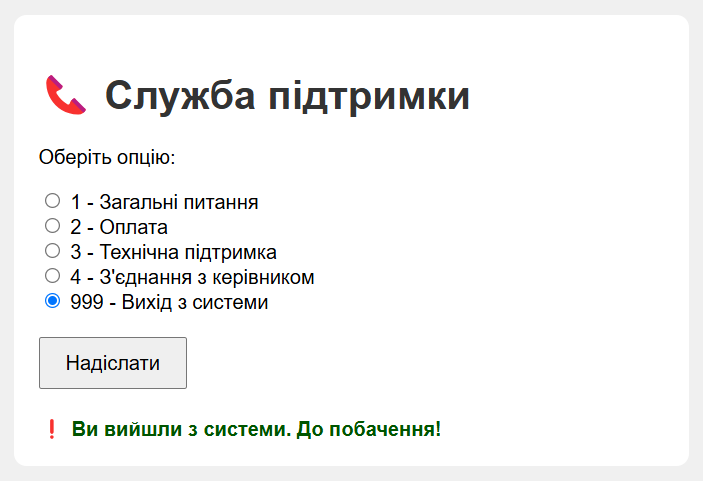

## Завдання 2: Mediator — Посередник

### Опис:
Рефакторинг прикладу з лекції з використанням патерна "Посередник". Створено об'єкт `CommandCentre`, через який здійснюється взаємодія між `Aircraft` та `Runway`.

- `Aircraft` не знає про існування `Runway` і навпаки.
- Вся логіка взаємодії перенесена до `CommandCentre`.

### Демонстрація:
- У головному методі створено об'єкти літаків і злітно-посадкових смуг, керування якими здійснюється через посередника.
- Відображено, як за допомогою посередника літаки можуть взаємодіяти з злітно-посадковими смугами без прямого знання один про одного.

### Скріншоти:
**1. Підйом літака для зльоту:**
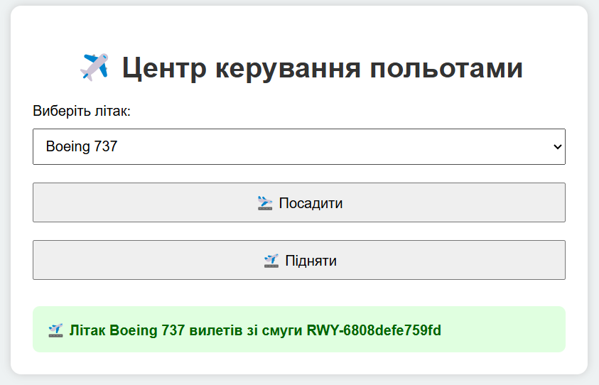

**2. Літак отримує підтвердження та здійснює посадку:**
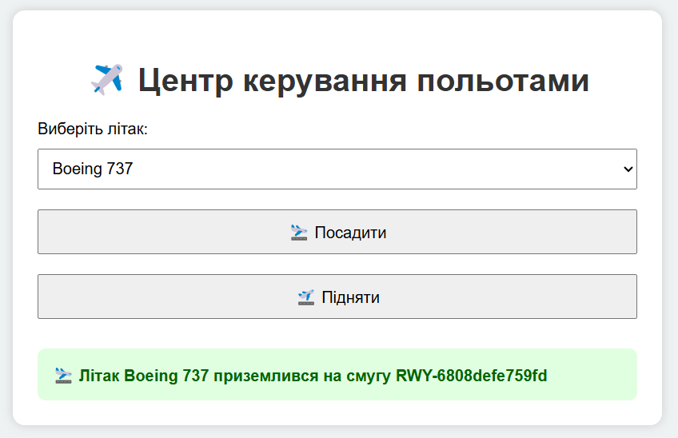

**3. Неможливо знайти вільну смугу для посадки:**
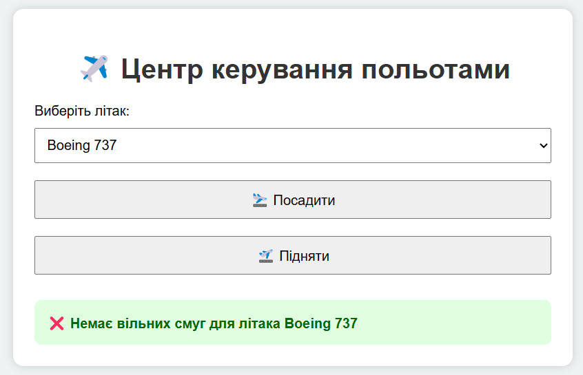

**4. Підйом літака для зльоту:**
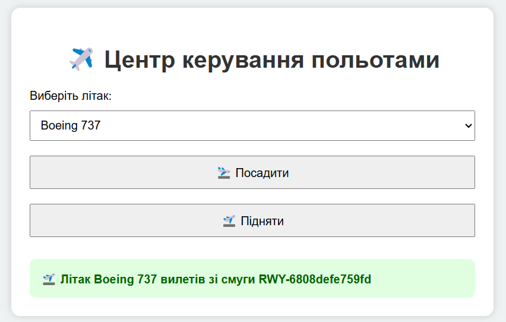

**5. Літак отримує підтвердження та виконує посадку:**
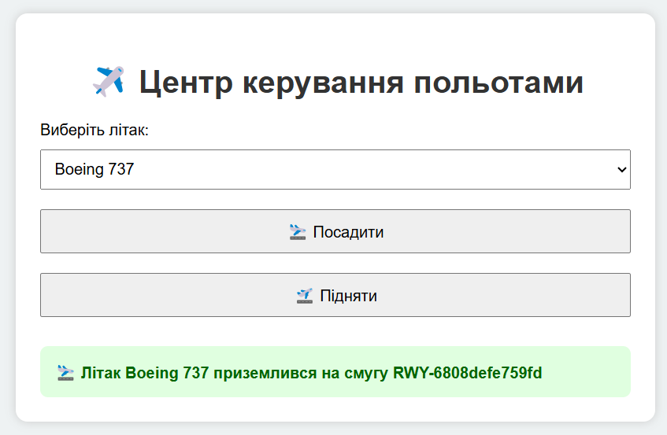

**6. Неможливо знайти вільну смугу для посадки:**

## Завдання 5: Memento — Мементо

### Опис:
Реалізовано спрощену версію текстового редактора з підтримкою збереження стану та скасування змін.

- `TextEditor` містить об'єкт `TextDocument`.
- Використовується патерн Memento для збереження та відновлення стану документа.
- Реалізовано команди "Зберегти" та "Скасувати".

### Демонстрація:
- У головному методі симулюються редагування документа, збереження стану та відкат змін.
- Вивід у консоль демонструє, як змінюється і відновлюється текст.

### Скріншот:
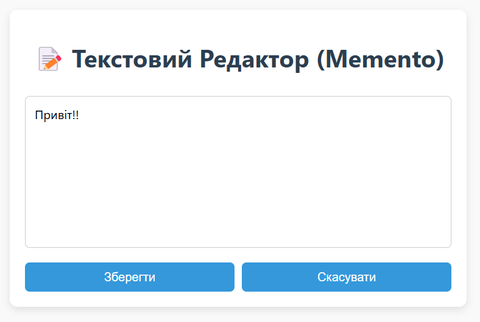
