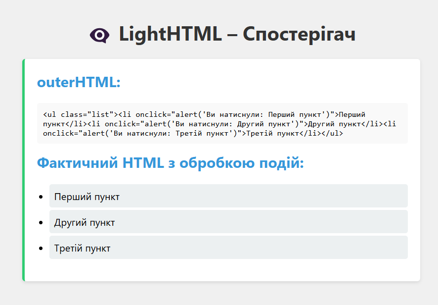
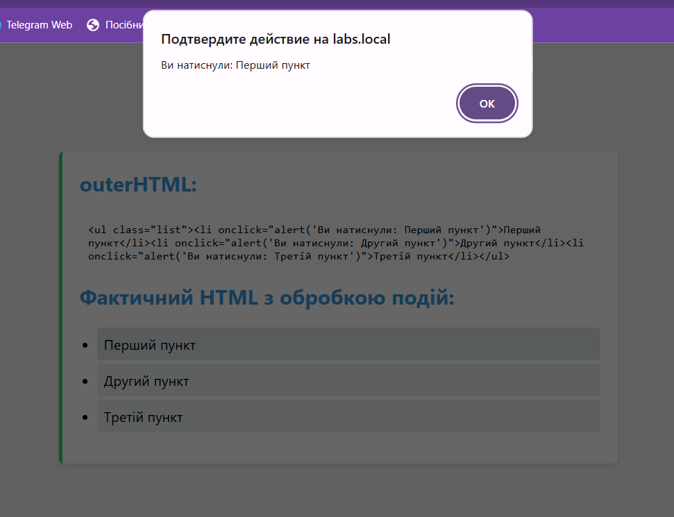
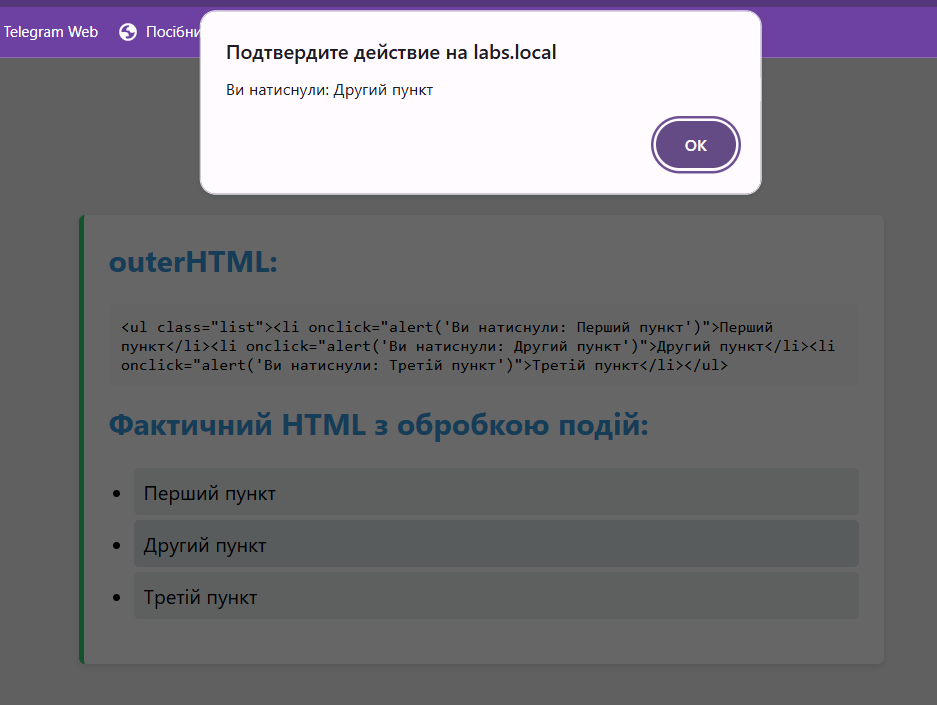
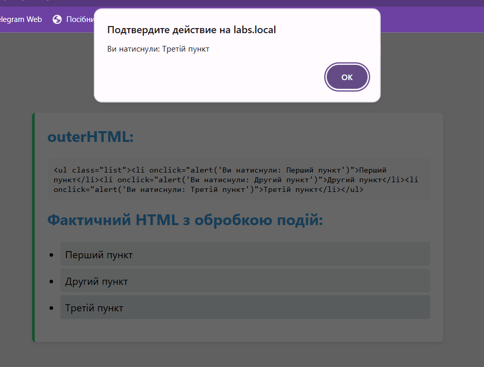

## Завдання 3: Спостерігач — Додавання EventListener до LightHTML

### Опис:
У цьому завданні реалізовано можливість підписки на різні події в кастомній бібліотеці **LightHTML**. За допомогою патерну *Observer* додано функціональність для додавання обробників подій (наприклад, `click`, `mouseover`) до HTML-елементів. Після підписки елементи реагують на події за допомогою JavaScript-обробників.

### Ключові функції:
1. Додано можливість додавання обробників подій до HTML-елементів через метод `addEventListener`.
2. Підтримуються різні типи подій: `click`, `mouseover`, тощо.
3. Код можна протестувати, використовуючи події на елементах списку.

### Демонстрація:

- У головному методі програми створено HTML-елемент `ul` зі списком `li`. Кожен елемент списку реагує на події `click`.

### Скріншоти:

**1. Загальний вигляд":**

**2. Перший пункт":**

**3. Другий пункт:**

**4. Третій пункт:**

