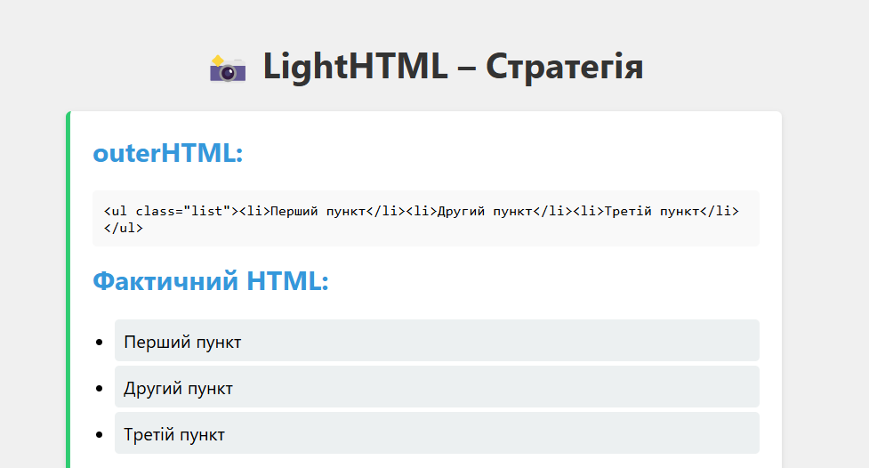
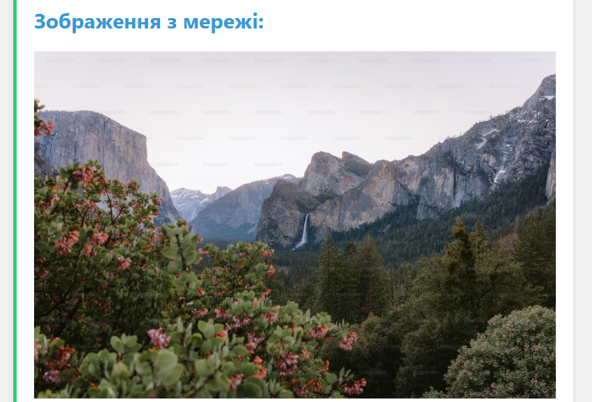
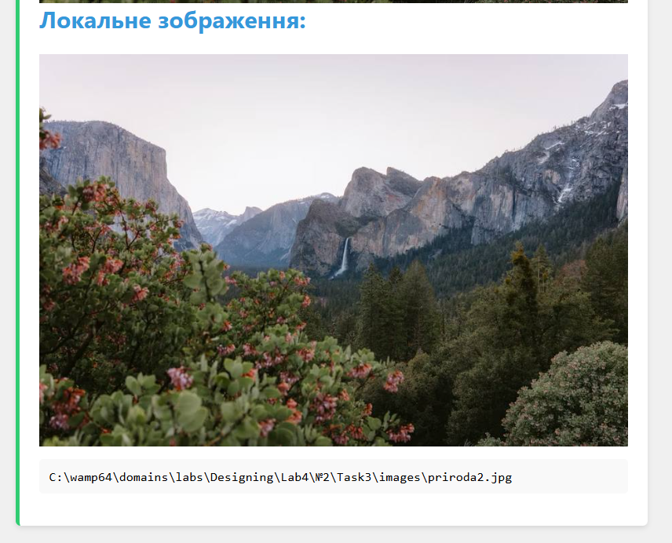

## Завдання 4: Strategy — Стратегія

### Опис:
Розширено функціональність бібліотеки **LightHTML**, реалізовано патерн "Стратегія" для завантаження зображень. Тепер елементи зображень (`LightImageNode`) можуть використовувати різні стратегії завантаження в залежності від джерела:

- **NetworkImageStrategy** — для зображень з мережі (URL).
- **FileSystemImageStrategy** — для локальних зображень з директорії `images/`.

### Компоненти:
- `LightNode`: Абстрактний базовий клас для всіх HTML-вузлів.
- `LightTextNode`: Текстовий вузол.
- `LightElementNode`: Елемент вузол (теги, класи, атрибути, дочірні елементи).
- `LightImageNode`: Елемент-зображення, який використовує відповідну стратегію для генерації HTML.
- `NetworkImageStrategy` / `FileSystemImageStrategy`: Класи-стратегії, що реалізують метод `load`.

### Демонстрація:
- Створено список `<ul>` з елементами `<li>`, які містять текстові вузли.
- Підключено два зображення:
  - Одне з мережі (URL).
  - Друге з локального файлового шляху.
- На сторінці виводиться:
  - HTML-код (через `outerHTML()`).
  - Фактичний HTML зображення.
  - Результат виконання `realpath()` для локального файлу.

### Скріншоти:
**1. Виведення списку у форматі outerHTML та Фактичний HTML:** 

**2. Виведення зображення з мережі:**  

**3. Виведення зображення з локального файлу:**  

